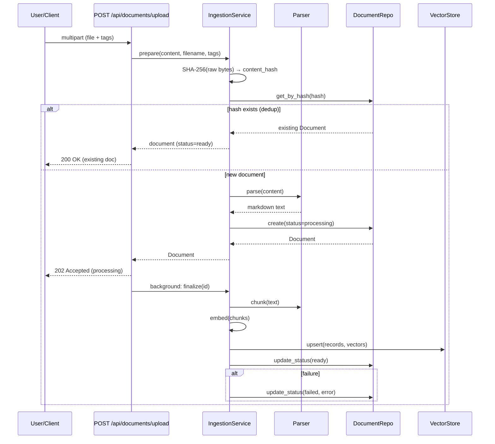

# Document Intelligence Server

Backend infrastructure for a tagged-document knowledge base: a document-management web UI, an ingestion pipeline (parse → chunk → embed → store), and an **MCP server** exposing the knowledge base as agent-ready tools over Streamable HTTP.

## Architecture

The system is composed of four Docker services and a layered Python backend:

### Service topology

```mermaid
flowchart TB
    subgraph User
        browser["Browser"]
        agent["MCP Client"]
    end

    subgraph DIS
        frontend["frontend (React)"]
        backend["backend (FastAPI)"]
        db["db (postgres)]
        qdrant["vector store (qdrant)"]
    end

    browser -->|GET /| frontend
    browser -->|/api/*| backend
    agent -->|"/mcp (Streamable HTTP) Bearer auth"| backend
    frontend -->|/api/* proxy| backend
    backend -->|SQL/asyncpg| db
    backend -->|gRPC| qdrant
```

### Data flow: document upload



## Stack

- **Vector store → Qdrant** — payload filtering pushdown for tag/document filter (single round-trip). pgvector considered, dedicated store keeps vector concerns out of relational schema. Hybrid search: dense (Qwen3) + sparse (FastEmbed BM25, local) named vectors, fused server-side via Reciprocal Rank Fusion (RRF) — catches exact keyword/domain-term matches that pure dense similarity misses.
- **Relational store → PostgreSQL 17** via SQLModel/asyncpg — standard, reliable, already in the stack.
- **Embedding model → Qwen3-Embedding-8B** via OpenRouter (OpenAI-compatible endpoint) — 8B multilingual, 32k ctx, truncated to 1536 dims (40% storage cost, strong retrieval). Asymmetric `input_type` (search_document vs search_query). Non-OpenAI provider through compatible API.
- **Chunking → semchunk** (semantic, ~1024 tok, no overlap) — splits on topic boundaries. Wrapped behind `Chunker` Protocol, size configurable.
- **Parsing → markitdown** — Markdown-first converter (PDF + Office + plain text). Pure-Python deps, no system packages. Wrapped behind `Parser` Protocol.
- **MCP transport → Streamable HTTP** via FastMCP — stateless, no session affinity.
- **MCP SDK → fastmcp** — cleaner mounting API than mcp SDK's built-in server.

## Quick start

```bash
cp .env.example .env
make build
make start
```

Then open the web UI in your browser:

- **Frontend (web UI): http://localhost:3000** ← start here
- REST API: http://localhost:8000 (health at `/health`)
- MCP endpoint: http://localhost:8000/mcp (Bearer token = `MCP_API_KEY`)
- Qdrant dashboard: http://localhost:6333/dashboard

> Use `http://` (not `https://`) — some browsers auto-upgrade to HTTPS, which the stack does not serve. On a remote host, use that host's IP or forward the port (`ssh -L 3000:localhost:3000 user@host`).

Dev without Docker:
```bash
cd backend && uv sync --dev && uv run uvicorn src.main:app --reload   # needs db + qdrant reachable
cd frontend && bun install && bun run dev
```

Load example data after starting the stack:
```bash
bash scripts/ingest_data.sh   # POST data/final/* to the running API
```

To regenerate the PDF/DOCX variants from source markdown (the .md/.txt/.html files in `data/final/` are maintained directly, not generated):
```bash
bash scripts/convert_data.sh   # requires pandoc + weasyprint
```

## Connecting an MCP client

Point any MCP-compatible client (Claude Desktop, MCP Inspector, a custom agent) at:

```
URL:    http://localhost:8000/mcp
Header: Authorization: Bearer <MCP_API_KEY>   # dev default: dev-mcp-key-change-me
```

MCP clients connect to `/mcp` and the SDK handles the protocol; raw HTTP probes must POST to `/mcp/` (trailing slash) — a GET on `/mcp` returns a 307 redirect. Auth is enforced on the JSON-RPC endpoint: a request without the token gets `401`. Five tools are registered: `list_documents`, `list_tags`, `search`, `search_by_tag`, `search_by_document`.

## Backlog

See `CHANGELOG.md` for v0.1.0.

### v0.1.1

- [x] **Hybrid search** — dense + sparse (BM25) named vectors fused via RRF.
- [x] **OCR for scanned PDFs** — extend ingestion with MarkItDown's `markitdown-ocr` extension plus update example documents
- [ ] **Evolve MCP tools** — enhance/improve tools.


## Repo layout
```
backend/    FastAPI app (REST + ingestion) + MCP server (see backend/README.md)
data/       Example documents for testing and demos
  raw/        Source markdown files (one per topic)
  final/      Ready-to-ingest documents in mixed formats
  mapping.yaml  Filename to tags mapping
frontend/   React SPA (see frontend/README.md)
scripts/    Dev tooling (convert_data.sh, ingest_data.sh)
sdd/        specs and change folders
```

## Workflow
See `AGENTS.md`. Spec-Driven Development drives implementation; specs live in `sdd/specs/`.
