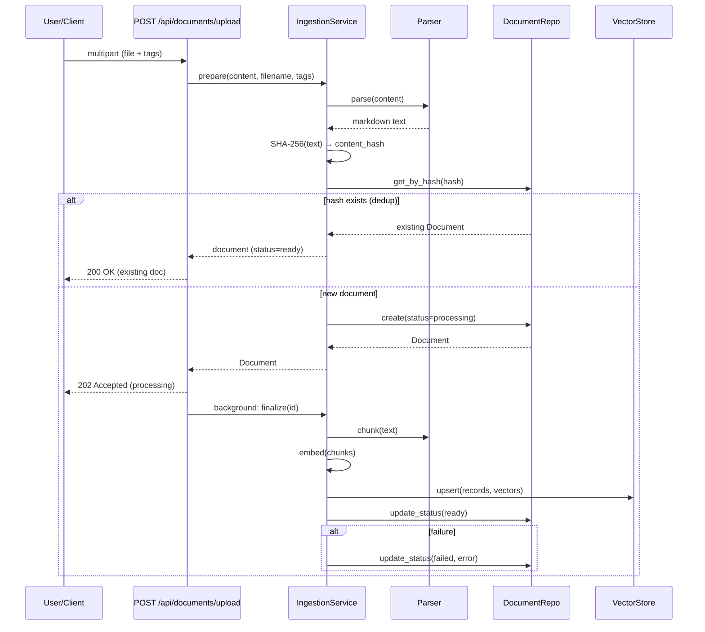

# Document Intelligence Server

Backend infrastructure for a tagged-document knowledge base: a document-management web UI, an ingestion pipeline (parse → chunk → embed → store), and an **MCP server** exposing the knowledge base as agent-ready tools over Streamable HTTP.

> **State: ingestion + REST API + MCP tools done.** The harness (lint, tests, Docker, CI, MCP endpoint wiring, auth) is green, the data models + repositories are in, the ingestion pipeline runs end-to-end with real adapters, the document-management REST API is operational (upload, list, get-by-id, delete, tags), and five MCP knowledge-base tools (`list_documents`, `list_tags`, `search`, `search_by_tag`, `search_by_document`) are registered and verified end-to-end via the live compose stack. The frontend UI is the remaining backlog item.

## Architecture

The system is composed of four Docker services and a layered Python backend:

### Service topology

```mermaid
flowchart TB
    subgraph User
        browser["Browser"]
        agent["MCP Agent<br/>(Claude, custom)"]
    end

    subgraph Docker
        frontend["frontend<br/>React SPA<br/>nginx :80"]
        backend["backend<br/>FastAPI<br/>:8000"]
        db[("db<br/>PostgreSQL 17<br/>:5432")]
        qdrant[("qdrant<br/>Vector store<br/>:6333")]
    end

    browser -->|GET /| frontend
    browser -->|/api/*| backend
    agent -->|/mcp (Streamable HTTP)
    Bearer auth| backend
    frontend -->|/api/* proxy| backend
    backend -->|SQL/asyncpg| db
    backend -->|gRPC| qdrant
```

### Data flow: document upload



## Stack

- **Vector store → Qdrant** — payload filtering pushdown for tag/document filter (single round-trip). pgvector considered, dedicated store keeps vector concerns out of relational schema.
- **Relational store → PostgreSQL 17** via SQLModel/asyncpg — standard, reliable, already in the stack.
- **Embedding model → Qwen3-Embedding-8B** via OpenRouter (OpenAI-compatible endpoint) — 8B multilingual, 32k ctx, truncated to 1536 dims (40% storage cost, strong retrieval). Asymmetric `input_type` (search_document vs search_query). Non-OpenAI provider through compatible API.
- **Chunking → semchunk** (semantic, ~1024 tok, no overlap) — splits on topic boundaries. Wrapped behind `Chunker` Protocol, size configurable.
- **Parsing → markitdown** — Markdown-first converter (PDF + Office + plain text). Pure-Python deps, no system packages. Wrapped behind `Parser` Protocol.
- **MCP transport → Streamable HTTP** via FastMCP — stateless, no session affinity.
- **MCP SDK → fastmcp** — cleaner mounting API than mcp SDK's built-in server.

## Quick start

```bash
cp .env.example .env
make build
make start
```

- REST API: http://localhost:8000 (health at `/health`)
- MCP endpoint: http://localhost:8000/mcp (Bearer token = `MCP_API_KEY`)
- Frontend: http://localhost:3000

Dev without Docker:
```bash
cd backend && uv sync --dev && uv run uvicorn src.main:app --reload   # needs db + qdrant reachable
cd frontend && bun install && bun run dev
```

## Connecting an MCP client

Point any MCP-compatible client (Claude Desktop, MCP Inspector, a custom agent) at:

```
URL:    http://localhost:8000/mcp
Header: Authorization: Bearer <MCP_API_KEY>   # dev default: dev-mcp-key-change-me
```

MCP clients connect to `/mcp` and the SDK handles the protocol; raw HTTP probes must POST to `/mcp/` (trailing slash) — a GET on `/mcp` returns a 307 redirect. Auth is enforced on the JSON-RPC endpoint: a request without the token gets `401`. Five tools are registered: `list_documents`, `list_tags`, `search`, `search_by_tag`, `search_by_document`.

## Backlog

### Backend
- [x] Data models + repositories (Document [parsed content + content-hash dedup], Tag, DocumentTag many-to-many link; SQLModel tables + Protocol-based repos; no Chunk table — chunks live in Qdrant)  _(done with a revision: tags stored as a Postgres `text[]` column on Document instead of a Tag/DocumentTag link — see `sdd/specs/documents.md`)_
- [x] Ingestion pipeline (markitdown parser, semchunk chunker, OpenRouter embedder; standalone services storing chunk text + embedding + payload in Qdrant, parsed content + metadata in Postgres)  _(done: `IngestionService` two-phase prepare/finalize + `VectorStore` Protocol; concrete adapters — `MarkItDownParser`, `SemchunkChunker`, `OpenRouterEmbedder`, `QdrantVectorStore` — implemented behind their Protocols, unit-tested, and verified end-to-end via a live compose smoke; Qdrant collection auto-provisioned on startup with cosine distance + payload indexes on `document_id`/`tags`; two pre-existing bugs fixed during integration — `db.py` session type and `Document` timestamp columns — see `sdd/specs/ingestion.md` + `vectors.md`)_
- [x] Document management REST API (upload → triggers async ingestion, list, get-by-id, delete → cascades to Qdrant; dedup via content hash; tags endpoint)
- [x] MCP tools (`list_documents`, `list_tags`, `search`, `search_by_tag`, `search_by_document`) — query-time embedding via `adapters.query_embedder`, FastMCP `Depends()` DI, five tools registered on the FastMCP instance; see `sdd/changes/mcp-knowledge-base-tools/`

### Frontend
- [ ] Document management UI (upload + tag, list, delete)


## Repo layout
```
backend/    FastAPI app (REST + ingestion) + MCP server (see backend/README.md)
frontend/   React SPA (see frontend/README.md)
sdd/        specs and change folders
```

## Workflow
See `AGENTS.md`. Spec-Driven Development drives implementation; specs live in `sdd/specs/`.
