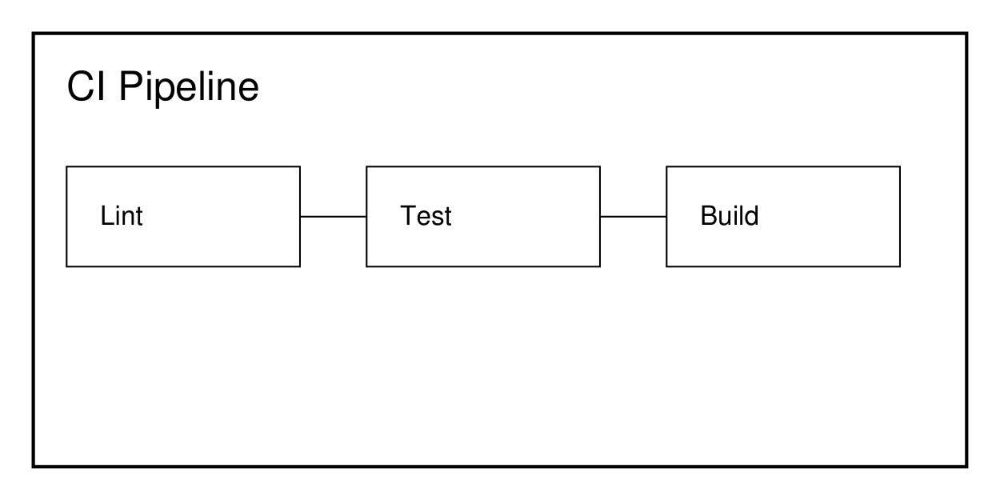

# Engineering Handbook

Standards and practices for all engineering teams at Acme Corp.

## Code Review

### PR Requirements

Every pull request must:

- Include a clear description of what and why.
- Pass all CI checks (lint, type-check, tests, build).
- Have at least one approval from a senior engineer.
- Include or update tests for any changed logic.

### Review Etiquette

- Review within 4 business hours during workdays.
- Be constructive, not critical. Suggest alternatives.
- Approve only when you're confident the change is correct.

## Branch Naming

```
<type>/<ticket>-<short-description>
```

Examples:

- `feat/DIS-123-add-ingestion-pipeline`
- `fix/DIS-456-fix-dedup-hash`
- `chore/DIS-789-upgrade-deps`

## CI Pipeline

Our CI runs on GitHub Actions with three stages:

1. **Lint** — ruff, ty, and prettier checks. Must pass in under 2 minutes.
2. **Test** — pytest with coverage ≥ 85%. Integration tests use a service container.
3. **Build** — Docker image build and push to our registry.

The stages run sequentially and short-circuit on the first failure, so a lint
failure never wastes CI minutes running the test suite:



### Lint Stage Details

The lint stage runs three tools in parallel within its own job:

- `ruff check` — catches unused imports, shadowed variables, and common
  correctness issues (bugbear rules). Configured with a 100-character line
  length and Python 3.12 target.
- `ruff format --check` — enforces single-quote strings and consistent
  indentation without actually rewriting files (that happens locally via
  pre-commit).
- `ty check` — static type checking against the SQLModel and Pydantic models
  used throughout the service layer.

Any of the three failing blocks the merge queue. There is no override for
lint failures — if a rule is wrong for the codebase, change the rule in
`pyproject.toml`, don't suppress it inline.

### Test Stage Details

The test stage spins up ephemeral Postgres and Qdrant containers via the same
compose file used for local development, so integration tests exercise the
real database driver and vector store rather than mocks. Three test markers
partition the suite:

- Unit tests (no marker) — run first, complete in under 10 seconds, no
  external services required.
- `integration` — real adapters against the ephemeral containers.
- `e2e` — full docker-compose stack, run only on merge to `main`, not on every
  PR, because container startup dominates the wall-clock time.

Coverage is measured on unit + integration combined and must stay at or above
85%. New code that drops coverage below the threshold fails the build even if
every individual test passes — the gate is on the aggregate, not per-file.

### Build Stage Details

The build stage produces two images: `dis-backend` and `dis-frontend`. Both
use multi-stage Dockerfiles so the final image excludes build-time
dependencies (compilers, dev packages). Images are tagged with the short git
SHA and, on `main`, additionally tagged `latest`. Registry pushes only happen
after the image passes a smoke test — a container is started, health-checked
against `/health`, and torn down before the tag is pushed.

## Commit Messages

Use conventional commits:

```
feat: add document dedup by content hash
fix: correct timestamp timezone handling
chore: bump qdrant-client to 1.13.0
```

No multi-line bodies. If you need more detail, put it in the PR description.

## Staging Deploy

Every merge to `main` automatically deploys to the staging environment. Production deploys are manually triggered via a GitHub Actions workflow dispatch.

### Staging Environment Details

Staging runs the same container images built in CI, deployed to a dedicated
namespace with its own Postgres and Qdrant instances — never shared with
production or with other engineers' feature environments. Data in staging is
reset weekly (Sunday 02:00 UTC) via a scheduled job that truncates all tables
and re-runs the example data ingestion script, so staging always reflects a
known-good baseline by Monday morning.

Feature flags default to "on" in staging and "off" in production, the
opposite of most other environments, specifically so that in-progress work is
visible to reviewers without needing a separate preview environment per PR.

### Production Deploy Checklist

Before triggering a production deploy:

1. Confirm the staging deploy for the same SHA has been up for at least one
   hour with no alerting.
2. Check the on-call calendar — deploys outside business hours require the
   on-call engineer's explicit sign-off in the deploy channel.
3. Confirm no active incident is open in the incident tracker (see the
   incident response runbook for what counts as "active").
4. Tag the release in git (`vX.Y.Z`) before dispatching the workflow, not
   after — the workflow reads the tag to populate the changelog.

Production deploys are rolling, not blue-green: old and new pods serve
traffic simultaneously for up to five minutes while the new revision passes
its readiness probe. This means schema changes must be backward compatible
with the previous release for that window — additive migrations only, no
column drops or renames in the same deploy that ships the code depending on
the new shape.

## Incident Response Basics

Engineering handles incidents according to severity:

- **SEV1** — customer-facing outage or data loss. Page on-call immediately,
  open an incident channel, status page updated within 15 minutes.
- **SEV2** — significant degradation, no full outage. On-call is notified but
  paging is optional depending on time of day.
- **SEV3** — minor issue, no customer impact. Filed as a ticket, addressed in
  the next business day.

Every SEV1 and SEV2 gets a postmortem within 5 business days of resolution.
Postmortems are blameless by policy — the document format asks "what
happened" and "what will prevent recurrence," never "who caused this."

## Local Development Setup

New engineers should be able to get a working local environment in under 30
minutes following these steps:

1. Clone the repository and copy `.env.example` to `.env`.
2. Run `make start` to bring up the full docker-compose stack (Postgres,
   Qdrant, backend, frontend).
3. Run the seed script (`scripts/ingest_data.sh`) to populate example
   documents so the UI isn't empty on first login.
4. Confirm `http://localhost:8000/health` and `http://localhost:5173` both
   respond before considering setup complete.

If any step fails, check `make logs` before asking in the engineering
channel — most first-day issues are a missing environment variable or a port
already in use by another local service.

## Dependency Management

Backend dependencies are managed with `uv`; frontend with `npm`. Both are
pinned via lockfiles (`uv.lock`, `package-lock.json`) committed to the repo.
Upgrading a dependency requires:

- A dedicated PR, not bundled with feature work — this keeps `git blame`
  useful when a dependency upgrade later turns out to be the cause of a
  regression.
- Running the full test suite locally before pushing, since CI dependency
  caching can mask a version mismatch that only appears on a clean install.
- For major version bumps, a note in the PR description summarizing the
  relevant breaking changes from the changelog, even if no code changed as a
  result.

Security patches are the one exception to the "dedicated PR" rule — a
`chore: bump X to patch CVE-YYYY-NNNNN` PR may bundle multiple unrelated
patch-level bumps if they all address disclosed vulnerabilities, since
merging quickly matters more than isolating blame in that case.

## API Design Guidelines

Internal service-to-service APIs follow REST conventions with a few
project-specific rules layered on top:

- Resource paths are always plural nouns (`/documents`, not `/document`), and
  nested resources are scoped under their parent only one level deep
  (`/documents/{id}/chunks`, never `/documents/{id}/chunks/{id}/embeddings`).
- Pagination uses cursor-based tokens, not offset/limit, because offset
  pagination drifts when rows are inserted or deleted between page requests —
  a problem this service hits constantly given continuous ingestion.
- Every list endpoint accepts a `limit` parameter with a server-enforced
  maximum (currently 100), even if the client requests more, to keep response
  payloads bounded regardless of client behavior.
- Errors return a consistent envelope: `{"error": {"code": "...", "message":
  "..."}}`, with `code` being a stable machine-readable string that clients
  can branch on, and `message` being a human-readable string that may change
  wording between releases without being a breaking change.
- Breaking changes to a public endpoint require a version bump in the path
  (`/v2/documents`) and a minimum 90-day deprecation window for the previous
  version, announced in the changelog and, for external consumers, by email.

### Idempotency

Write endpoints that could plausibly be retried by a client (uploads, in
particular) must be idempotent on some caller-supplied or content-derived
key. The document upload endpoint uses the SHA-256 hash of the raw upload
bytes as that key — a retried upload of the same bytes returns the existing
document rather than creating a duplicate. This is deliberate: network
retries after a timeout are common, and silently creating duplicate documents
would corrupt search results by returning the same content twice.

## Style Preferences Beyond the Linter

Some conventions aren't enforced by tooling and rely on reviewer judgment:

- Prefer early returns over nested conditionals when a function has more
  than two levels of nesting — readability matters more than avoiding a
  slightly longer function body.
- Name booleans as predicates (`is_ready`, `has_error`), never as bare nouns
  (`ready`, `error`) — a bare noun reads ambiguously at the call site.
- Avoid one-letter variable names outside of very short lambda bodies or
  loop counters; `doc` beats `d`, `chunk_index` beats `i` once a loop body
  exceeds a few lines.
- Comment only the non-obvious "why," never the "what" — a comment
  restating what the next line of code already says is noise a future reader
  has to filter out.
- Keep functions under roughly 40 lines; if a function grows past that, it is
  usually doing two things and should be split, not just reformatted.
